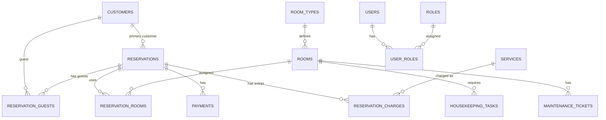

# Fase 0 - Ideologia del progetto e schema DB iniziale

# MAMB Hotel Management

MAMB Hotel Management e' un gestionale alberghiero personale sviluppato con Spring Boot, pensato per uso didattico, portfolio/CV e crescita progressiva nel tempo.

L'obiettivo non e' creare subito un software enorme, ma costruire una base solida, modulare e credibile.

## Visione del prodotto

Il gestionale deve aiutare un hotel a controllare le attivita' principali:

- prenotazioni
- clienti e storico soggiorni
- camere e disponibilita'
- check-in e check-out
- pagamenti
- dashboard operativa
- personale e permessi
- servizi extra
- reportistica
- manutenzione e housekeeping

Il progetto deve essere costruito a moduli, in modo che ogni area possa crescere senza rompere le altre.

## Tipi di struttura da considerare

Il software deve poter funzionare per:

- B&B o affittacamere
- hotel 1-2 stelle con gestione semplice
- hotel 3 stelle con prenotazioni, gruppi e servizi extra
- hotel 4-5 stelle con reparti, ruoli, housekeeping, servizi, pagamenti avanzati e report

Per questo motivo il database deve evitare scelte troppo rigide. Anche se all'inizio si implementa poco, lo schema deve lasciare spazio a evoluzioni future.

## Moduli principali

## 1. Gestione prenotazioni

Funzioni attese:

- creare, modificare e cancellare prenotazioni
- gestire check-in e check-out previsti
- gestire check-in e check-out effettivi
- assegnare camere manualmente
- supportare in futuro assegnazione automatica
- visualizzare disponibilita' in tempo reale
- evitare overbooking
- gestire prenotazioni singole e di gruppo
- gestire stati della prenotazione
- collegare prenotazioni a clienti, camere e pagamenti

Stati iniziali:

- PENDING: in attesa
- CONFIRMED: confermata
- CHECKED_IN: cliente arrivato
- CHECKED_OUT: cliente partito
- CANCELLED: cancellata
- NO_SHOW: cliente non arrivato

## 2. Gestione clienti

Funzioni attese:

- anagrafica clienti
- documenti
- contatti
- nazionalita'
- storico soggiorni
- note interne
- preferenze
- dati fiscali per fattura

## 3. Gestione camere

Funzioni attese:

- creazione e modifica camere
- numero camera
- piano
- tipologia
- capacita'
- stato operativo
- collegamento con prenotazioni
- storico manutenzioni
- stato pulizia

Stati camera iniziali:

- AVAILABLE: disponibile
- OCCUPIED: occupata
- DIRTY: da pulire
- CLEANING: in pulizia
- MAINTENANCE: manutenzione
- OUT_OF_SERVICE: fuori servizio

## 4. Gestione pagamenti

Funzioni attese:

- registrare pagamenti
- registrare acconti
- metodi di pagamento
- stato pagamento
- saldo residuo
- collegamento a prenotazione
- futura gestione fatture/ricevute

Stati pagamento iniziali:

- UNPAID: non pagato
- PARTIALLY_PAID: parzialmente pagato
- PAID: pagato
- REFUNDED: rimborsato

## 5. Dashboard operativa

Funzioni attese:

- calendario prenotazioni
- stato camere
- arrivi giornalieri
- partenze giornaliere
- camere occupate/disponibili
- prenotazioni in attesa
- pagamenti da completare
- camere da pulire

## Moduli futuri importanti

## 6. Housekeeping

- assegnazione pulizie
- stato camera dopo check-out
- personale assegnato
- note per camera
- priorita' pulizia

## 7. Manutenzione

- segnalazioni problemi
- camere fuori servizio
- stato intervento
- storico manutenzioni

## 8. Servizi extra

- colazione
- spa
- parcheggio
- minibar
- late check-out
- transfer
- ristorante
- altri addebiti sul conto della prenotazione

## 9. Personale e ruoli

- utenti del sistema
- ruoli
- permessi
- receptionist
- manager
- housekeeping
- amministratore

## 10. Reportistica

- occupazione camere
- ricavi
- prenotazioni cancellate
- no-show
- pagamenti pendenti
- performance per periodo

## Roadmap consigliata

## Fase 0 - Ideologia e architettura

Obiettivi:

- definire moduli
- definire entita' principali
- definire schema DB iniziale
- scegliere convenzioni di progetto
- preparare README e documentazione

Output:

- documento di visione
- schema dati iniziale
- lista feature MVP

## Fase 1 - Setup backend Spring Boot

Obiettivi:

- creare progetto Spring Boot
- configurare PostgreSQL
- configurare JPA/Hibernate
- configurare Flyway o Liquibase per migrazioni DB
- creare struttura package
- creare prime entity

Package suggeriti:

- config
- customer
- room
- reservation
- payment
- dashboard
- common

## Fase 2 - MVP backend

Obiettivi:

- CRUD clienti
- CRUD camere
- CRUD prenotazioni
- controllo disponibilita'
- impedire overbooking
- registrazione pagamenti base

## Fase 3 - API REST complete

Obiettivi:

- endpoint ordinati
- validazione input
- gestione errori
- DTO request/response
- documentazione Swagger/OpenAPI

## Fase 4 - Frontend

Obiettivi:

- dashboard
- lista camere
- calendario prenotazioni
- scheda cliente
- gestione pagamento

## Fase 5 - Funzioni professionali

Obiettivi:

- ruoli e login
- housekeeping
- manutenzione
- servizi extra
- reportistica
- esportazioni

## Schema DB iniziale

Questo schema e' pensato per PostgreSQL e Spring Boot. All'inizio si possono implementare solo le tabelle fondamentali, lasciando le altre come evoluzione.

## Tabelle core

### customers

Contiene l'anagrafica dei clienti.

Campi:

- id
- first_name
- last_name
- email
- phone
- date_of_birth
- nationality
- document_type
- document_number
- tax_code
- address
- city
- country
- notes
- created_at
- updated_at

Relazioni:

- un cliente puo' avere molte prenotazioni tramite reservation_guests

### room_types

Contiene le tipologie di camera.

Campi:

- id
- name
- description
- max_guests
- base_price
- created_at
- updated_at

Esempi:

- Single
- Double
- Twin
- Triple
- Suite
- Family

### rooms

Contiene le camere fisiche dell'hotel.

Campi:

- id
- room_number
- floor
- room_type_id
- status
- notes
- created_at
- updated_at

Relazioni:

- una camera appartiene a una tipologia
- una camera puo' essere assegnata a molte prenotazioni nel tempo

Vincoli:

- room_number unico

### reservations

Contiene la prenotazione principale.

Campi:

- id
- code
- primary_customer_id
- check_in_date
- check_out_date
- adults
- children
- status
- source
- special_requests
- total_amount
- created_at
- updated_at

Relazioni:

- una prenotazione ha un cliente principale
- una prenotazione puo' avere piu' ospiti
- una prenotazione puo' avere una o piu' camere assegnate
- una prenotazione puo' avere piu' pagamenti

Vincoli:

- code unico
- check_out_date maggiore di check_in_date

### reservation_guests

Collega prenotazioni e clienti/ospiti.

Serve per supportare:

- prenotazione singola
- coppie
- famiglie
- gruppi
- storico soggiorni del cliente

Campi:

- id
- reservation_id
- customer_id
- role
- created_at

Esempi role:

- PRIMARY
- GUEST

Vincoli:

- evitare duplicati tra reservation_id e customer_id

### reservation_rooms

Collega prenotazioni e camere.

Serve per supportare:

- una prenotazione con una camera
- gruppi con piu' camere
- cambio camera durante il soggiorno
- assegnazione camera successiva alla prenotazione

Campi:

- id
- reservation_id
- room_id
- start_date
- end_date
- price_per_night
- created_at

Vincoli:

- evitare sovrapposizioni di date per la stessa camera

### payments

Contiene i pagamenti collegati alle prenotazioni.

Campi:

- id
- reservation_id
- amount
- method
- status
- paid_at
- transaction_reference
- notes
- created_at
- updated_at

Esempi method:

- CASH
- CARD
- BANK_TRANSFER
- ONLINE
- OTHER

## Tabelle operative future

### housekeeping_tasks

Campi:

- id
- room_id
- assigned_user_id
- status
- priority
- due_date
- notes
- created_at
- updated_at

### maintenance_tickets

Campi:

- id
- room_id
- reported_by_user_id
- status
- priority
- description
- resolved_at
- created_at
- updated_at

### services

Catalogo dei servizi extra.

Campi:

- id
- name
- description
- price
- active
- created_at
- updated_at

### reservation_charges

Addebiti extra sulla prenotazione.

Campi:

- id
- reservation_id
- service_id
- description
- quantity
- unit_price
- total_price
- charged_at
- created_at

### users

Utenti del gestionale.

Campi:

- id
- username
- email
- password_hash
- first_name
- last_name
- active
- created_at
- updated_at

### roles

Campi:

- id
- name
- description

### user_roles

Campi:

- id
- user_id
- role_id

## Diagramma ER semplificato

## MVP consigliato

Per non perdersi, il primo obiettivo concreto dovrebbe essere:

- creare clienti
- creare tipologie camera
- creare camere
- creare prenotazioni
- assegnare una camera a una prenotazione
- controllare disponibilita' per date
- impedire overbooking
- registrare pagamento base
- visualizzare arrivi e partenze del giorno

Questo e' abbastanza piccolo da essere realizzabile, ma abbastanza serio da sembrare gia' un gestionale reale.

## Regole di business iniziali

Regole importanti da implementare presto:

- una prenotazione non puo' avere check-out prima o uguale al check-in
- una camera non puo' essere assegnata a due prenotazioni sovrapposte
- una prenotazione cancellata non occupa disponibilita'
- una camera in manutenzione non dovrebbe essere prenotabile
- il totale pagato non dovrebbe superare il totale prenotazione, salvo rimborsi o casi gestiti
- il check-in effettivo puo' avvenire solo su prenotazioni confermate
- il check-out effettivo puo' avvenire solo dopo check-in

## Decisioni architetturali iniziali

Schema DB:
MAMB Hotel Management — Schema DB V1

1. customers

Descrizione

Contiene l’anagrafica dei clienti dell’hotel.

Un cliente può essere:
- intestatario di una prenotazione;
- ospite dentro una prenotazione;
- cliente storico tornato più volte;
- soggetto fiscale per fattura/ricevuta.

Attributi

Campo | Tipo | Chiave | Note
id | BIGSERIAL | PK | Identificativo cliente
first_name | VARCHAR(100) | | Nome
last_name | VARCHAR(100) | | Cognome
email | VARCHAR(150) | | Email cliente
phone | VARCHAR(50) | | Telefono
date_of_birth | DATE | | Data di nascita
nationality | VARCHAR(100) | | Nazionalità
tax_code | VARCHAR(50) | | Codice fiscale
address | VARCHAR(255) | | Indirizzo
city | VARCHAR(100) | | Città
country | VARCHAR(100) | | Paese
notes | TEXT | | Note interne
created_at | TIMESTAMP | | Data creazione
updated_at | TIMESTAMP | | Ultima modifica

Relazioni

customers 1:N reservations
customers 1:N reservation_guests
customers 1:N customer_documents

Vincoli consigliati

id NOT NULL
first_name NOT NULL
last_name NOT NULL

Email non la renderei obbligatoria, perché in hotel può capitare di registrare clienti senza email.

2. customer_documents

Descrizione

Contiene i documenti dei clienti.

La separo da customers perché un cliente nel tempo può avere più documenti o può aggiornare un documento scaduto.

Attributi

Campo | Tipo | Chiave | Note
id | BIGSERIAL | PK | Identificativo documento
customer_id | BIGINT | FK | Cliente proprietario del documento
document_type | VARCHAR(50) | | Tipo documento
document_number | VARCHAR(100) | | Numero documento
issuing_country | VARCHAR(100) | | Paese rilascio
issue_date | DATE | | Data rilascio
expiry_date | DATE | | Data scadenza
created_at | TIMESTAMP | | Data creazione
updated_at | TIMESTAMP | | Ultima modifica

Chiavi esterne

customer_id -> customers.id

Relazioni

customers 1:N customer_documents

Enum consigliato

document_type:
- ID_CARD
- PASSPORT
- DRIVING_LICENSE
- OTHER

3. room_types

Descrizione

Contiene le tipologie di camere vendibili.

Esempi:
- Single
- Double
- Twin
- Triple
- Suite
- Family

La tipologia descrive la categoria commerciale della camera.

Attributi

Campo | Tipo | Chiave | Note
id | BIGSERIAL | PK | Identificativo tipologia
name | VARCHAR(100) | UNIQUE | Nome tipologia
description | TEXT | | Descrizione
max_guests | INT | | Numero massimo ospiti
base_price | NUMERIC(10,2) | | Prezzo base
created_at | TIMESTAMP | | Data creazione
updated_at | TIMESTAMP | | Ultima modifica

Relazioni

room_types 1:N rooms

Vincoli consigliati

name NOT NULL
max_guests > 0
base_price >= 0

4. rooms

Descrizione

Contiene le camere fisiche dell’hotel.

Esempi:
- 101
- 102
- 201
- Suite 301

Una camera appartiene a una tipologia, ma può essere assegnata a molte prenotazioni nel tempo.

Attributi

Campo | Tipo | Chiave | Note
id | BIGSERIAL | PK | Identificativo camera
room_type_id | BIGINT | FK | Tipologia camera
room_number | VARCHAR(20) | UNIQUE | Numero camera
floor | INT | | Piano
operational_status | VARCHAR(50) | | Stato operativo
cleaning_status | VARCHAR(50) | | Stato pulizia
notes | TEXT | | Note interne
created_at | TIMESTAMP | | Data creazione
updated_at | TIMESTAMP | | Ultima modifica

Chiavi esterne

room_type_id -> room_types.id

Relazioni

room_types 1:N rooms
rooms 1:N reservation_rooms
rooms 1:N room_blocks
rooms 1:N housekeeping_tasks
rooms 1:N maintenance_tickets
rooms 1:N room_status_history

Enum consigliati

operational_status:
- ACTIVE
- MAINTENANCE
- OUT_OF_SERVICE

cleaning_status:
- CLEAN
- DIRTY
- CLEANING
- INSPECTION_REQUIRED

Nota importante

Non salverei AVAILABLE e OCCUPIED direttamente dentro rooms.

La disponibilità della camera va calcolata dalle prenotazioni:

rooms + reservation_rooms + reservations

Così eviti incoerenze.

5. room_blocks

Descrizione

Serve per bloccare una camera anche se non esiste una prenotazione.

Esempi:
- camera fuori servizio
- manutenzione programmata
- uso interno
- camera non vendibile

È importante per il controllo disponibilità.

Attributi

Campo | Tipo | Chiave | Note
id | BIGSERIAL | PK | Identificativo blocco
room_id | BIGINT | FK | Camera bloccata
start_date | DATE | | Inizio blocco
end_date | DATE | | Fine blocco
block_type | VARCHAR(50) | | Tipo blocco
reason | TEXT | | Motivo
created_by_user_id | BIGINT | FK | Utente che ha creato il blocco
created_at | TIMESTAMP | | Data creazione
updated_at | TIMESTAMP | | Ultima modifica

Chiavi esterne

room_id -> rooms.id
created_by_user_id -> users.id

Relazioni

rooms 1:N room_blocks
users 1:N room_blocks

Enum consigliato

block_type:
- MAINTENANCE
- OUT_OF_SERVICE
- INTERNAL_USE
- OTHER

Vincoli consigliati

end_date > start_date

6. reservations

Descrizione

È la tabella principale delle prenotazioni.

Una prenotazione rappresenta il soggiorno previsto o effettivo di uno o più clienti.

È il centro del sistema.

Attributi

Campo | Tipo | Chiave | Note
id | BIGSERIAL | PK | Identificativo prenotazione
code | VARCHAR(50) | UNIQUE | Codice prenotazione
primary_customer_id | BIGINT | FK | Cliente principale
check_in_date | DATE | | Data arrivo prevista
check_out_date | DATE | | Data partenza prevista
actual_check_in_at | TIMESTAMP | | Check-in reale
actual_check_out_at | TIMESTAMP | | Check-out reale
adults | INT | | Numero adulti
children | INT | | Numero bambini
status | VARCHAR(50) | | Stato prenotazione
source | VARCHAR(50) | | Origine prenotazione
special_requests | TEXT | | Richieste speciali
total_amount | NUMERIC(10,2) | | Totale previsto
created_at | TIMESTAMP | | Data creazione
updated_at | TIMESTAMP | | Ultima modifica

Chiavi esterne

primary_customer_id -> customers.id

Relazioni

customers 1:N reservations
reservations 1:N reservation_guests
reservations 1:N reservation_rooms
reservations 1:N payments
reservations 1:N reservation_charges
reservations 1:N invoices
reservations 1:N reservation_status_history

Enum consigliato

status:
- PENDING
- CONFIRMED
- CHECKED_IN
- CHECKED_OUT
- CANCELLED
- NO_SHOW

source:
- DIRECT
- PHONE
- EMAIL
- BOOKING_COM
- AIRBNB
- EXPEDIA
- WALK_IN
- OTHER

Vincoli consigliati

code UNIQUE
check_out_date > check_in_date
adults >= 1
children >= 0
total_amount >= 0

7. reservation_guests

Descrizione

Collega le prenotazioni ai clienti/ospiti.

Serve perché una prenotazione può contenere più persone.

Esempio:

Prenotazione #1001
- Mario Rossi, PRIMARY
- Laura Bianchi, GUEST
- Luca Rossi, GUEST

Attributi

Campo | Tipo | Chiave | Note
id | BIGSERIAL | PK | Identificativo riga
reservation_id | BIGINT | FK | Prenotazione
customer_id | BIGINT | FK | Cliente/ospite
role | VARCHAR(50) | | Ruolo nella prenotazione
created_at | TIMESTAMP | | Data creazione

Chiavi esterne

reservation_id -> reservations.id
customer_id -> customers.id

Relazioni

reservations 1:N reservation_guests
customers 1:N reservation_guests

Concettualmente:

reservations N:M customers

tramite reservation_guests.

Enum consigliato

role:
- PRIMARY
- GUEST

Vincoli consigliati

UNIQUE(reservation_id, customer_id)

8. reservation_rooms

Descrizione

Collega le prenotazioni alle camere.

Questa tabella è fondamentale perché permette:
- prenotazione con una camera;
- prenotazione con più camere;
- gruppi;
- cambio camera durante il soggiorno;
- controllo disponibilità;
- prevenzione overbooking.

Attributi

Campo | Tipo | Chiave | Note
id | BIGSERIAL | PK | Identificativo assegnazione
reservation_id | BIGINT | FK | Prenotazione
room_id | BIGINT | FK | Camera assegnata
start_date | DATE | | Inizio utilizzo camera
end_date | DATE | | Fine utilizzo camera
price_per_night | NUMERIC(10,2) | | Prezzo per notte
created_at | TIMESTAMP | | Data creazione
updated_at | TIMESTAMP | | Ultima modifica

Chiavi esterne

reservation_id -> reservations.id
room_id -> rooms.id

Relazioni

reservations 1:N reservation_rooms
rooms 1:N reservation_rooms

Concettualmente:

reservations N:M rooms

tramite reservation_rooms.

Vincoli consigliati

end_date > start_date
price_per_night >= 0

Vincolo anti-overbooking

Regola logica:

La stessa camera non può essere assegnata a due prenotazioni attive con date sovrapposte.

Prenotazioni che occupano disponibilità:
- CONFIRMED
- CHECKED_IN

Prenotazioni che non occupano disponibilità:
- CANCELLED
- NO_SHOW
- CHECKED_OUT
- 

9. services

Descrizione

Catalogo dei servizi extra vendibili dall’hotel.

Esempi:
- colazione
- parcheggio
- spa
- minibar
- late check-out
- transfer
- ristorante

Attributi

Campo | Tipo | Chiave | Note
id | BIGSERIAL | PK | Identificativo servizio
name | VARCHAR(100) | UNIQUE | Nome servizio
description | TEXT | | Descrizione
default_price | NUMERIC(10,2) | | Prezzo standard
active | BOOLEAN | | Servizio attivo/non attivo
created_at | TIMESTAMP | | Data creazione
updated_at | TIMESTAMP | | Ultima modifica

Relazioni

services 1:N reservation_charges

Vincoli consigliati

name NOT NULL
default_price >= 0
active DEFAULT true

10. reservation_charges

Descrizione

Rappresenta gli addebiti sul conto della prenotazione.

Può contenere:
- costo camera;
- colazione;
- parcheggio;
- spa;
- minibar;
- tassa di soggiorno;
- penale;
- sconto;
- addebito manuale.

Questa tabella è importante perché separa il concetto di “quanto devo pagare” dal concetto di “quanto ho pagato”.

Attributi

Campo | Tipo | Chiave | Note
id | BIGSERIAL | PK | Identificativo addebito
reservation_id | BIGINT | FK | Prenotazione
service_id | BIGINT | FK nullable | Servizio collegato
description | VARCHAR(255) | | Descrizione addebito
charge_type | VARCHAR(50) | | Tipo addebito
quantity | INT | | Quantità
unit_price | NUMERIC(10,2) | | Prezzo unitario
total_price | NUMERIC(10,2) | | Totale riga
charged_at | TIMESTAMP | | Data addebito
created_by_user_id | BIGINT | FK | Utente che ha inserito l’addebito
created_at | TIMESTAMP | | Data creazione
updated_at | TIMESTAMP | | Ultima modifica

Chiavi esterne

reservation_id -> reservations.id
service_id -> services.id
created_by_user_id -> users.id

Relazioni

reservations 1:N reservation_charges
services 1:N reservation_charges
users 1:N reservation_charges

Enum consigliato

charge_type:
- ROOM_RATE
- SERVICE
- CITY_TAX
- PENALTY
- DISCOUNT
- OTHER

Vincoli consigliati

quantity > 0
unit_price >= 0
total_price >= 0

11. payments

Descrizione

Contiene i pagamenti registrati per una prenotazione.

Una prenotazione può avere più pagamenti:
- acconto
- saldo
- pagamento parziale
- rimborso gestito separatamente

Attributi

Campo | Tipo | Chiave | Note
id | BIGSERIAL | PK | Identificativo pagamento
reservation_id | BIGINT | FK | Prenotazione
amount | NUMERIC(10,2) | | Importo pagato
method | VARCHAR(50) | | Metodo pagamento
status | VARCHAR(50) | | Stato pagamento
paid_at | TIMESTAMP | | Data pagamento
transaction_reference | VARCHAR(150) | | Riferimento transazione
notes | TEXT | | Note
created_by_user_id | BIGINT | FK | Utente che registra il pagamento
created_at | TIMESTAMP | | Data creazione
updated_at | TIMESTAMP | | Ultima modifica

Chiavi esterne

reservation_id -> reservations.id
created_by_user_id -> users.id

Relazioni

reservations 1:N payments
users 1:N payments

Enum consigliato

method:
- CASH
- CARD
- BANK_TRANSFER
- ONLINE
- OTHER

status:
- PENDING
- COMPLETED
- FAILED
- CANCELLED
- REFUNDED

Vincoli consigliati

amount > 0

12. invoices

Descrizione

Contiene fatture o ricevute collegate a una prenotazione.

Non è obbligatoria per l’MVP, ma è importante per un gestionale completo.

Attributi

Campo | Tipo | Chiave | Note
id | BIGSERIAL | PK | Identificativo documento fiscale
reservation_id | BIGINT | FK | Prenotazione
invoice_number | VARCHAR(100) | UNIQUE | Numero fattura/ricevuta
invoice_type | VARCHAR(50) | | Tipo documento
status | VARCHAR(50) | | Stato documento
issue_date | DATE | | Data emissione
customer_name | VARCHAR(200) | | Nome cliente al momento emissione
customer_tax_code | VARCHAR(50) | | Codice fiscale
billing_address | VARCHAR(255) | | Indirizzo fatturazione
total_amount | NUMERIC(10,2) | | Totale documento
created_at | TIMESTAMP | | Data creazione
updated_at | TIMESTAMP | | Ultima modifica

Chiavi esterne

reservation_id -> reservations.id

Relazioni

reservations 1:N invoices

Enum consigliato

invoice_type:
- RECEIPT
- INVOICE

status:
- DRAFT
- ISSUED
- CANCELLED

13. users

Descrizione

Contiene gli utenti del gestionale.

Esempi:
- admin
- receptionist
- manager
- addetto pulizie
- manutentore

Attributi

Campo | Tipo | Chiave | Note
id | BIGSERIAL | PK | Identificativo utente
username | VARCHAR(100) | UNIQUE | Username
email | VARCHAR(150) | UNIQUE | Email
password_hash | VARCHAR(255) | | Password cifrata/hashata
first_name | VARCHAR(100) | | Nome
last_name | VARCHAR(100) | | Cognome
active | BOOLEAN | | Utente attivo
created_at | TIMESTAMP | | Data creazione
updated_at | TIMESTAMP | | Ultima modifica

Relazioni

users 1:N user_roles
users 1:N housekeeping_tasks
users 1:N maintenance_tickets
users 1:N reservation_status_history
users 1:N room_status_history
users 1:N audit_logs

Vincoli consigliati

username UNIQUE NOT NULL
email UNIQUE NOT NULL
password_hash NOT NULL
active DEFAULT true

14. roles

Descrizione

Contiene i ruoli assegnabili agli utenti.

Esempi:
- ADMIN
- MANAGER
- RECEPTIONIST
- HOUSEKEEPING
- MAINTENANCE

Attributi

Campo | Tipo | Chiave | Note
id | BIGSERIAL | PK | Identificativo ruolo
name | VARCHAR(100) | UNIQUE | Nome ruolo
description | TEXT | | Descrizione
created_at | TIMESTAMP | | Data creazione
updated_at | TIMESTAMP | | Ultima modifica

Relazioni

roles 1:N user_roles
roles 1:N role_permissions

15. user_roles

Descrizione

Tabella ponte tra utenti e ruoli.

Serve perché:
- un utente può avere più ruoli
- un ruolo può essere assegnato a più utenti

Attributi

Campo | Tipo | Chiave | Note
id | BIGSERIAL | PK | Identificativo riga
user_id | BIGINT | FK | Utente
role_id | BIGINT | FK | Ruolo
created_at | TIMESTAMP | | Data assegnazione

Chiavi esterne

user_id -> users.id
role_id -> roles.id

Relazioni

users 1:N user_roles
roles 1:N user_roles

Concettualmente:

users N:M roles

tramite user_roles.

Vincoli consigliati

UNIQUE(user_id, role_id)

16. permissions

Descrizione

Contiene i permessi tecnici del sistema.

Esempi:
- CUSTOMER_READ
- CUSTOMER_WRITE
- ROOM_READ
- ROOM_WRITE
- RESERVATION_READ
- RESERVATION_WRITE
- PAYMENT_READ
- PAYMENT_WRITE
- USER_MANAGE
- REPORT_READ

Attributi

Campo | Tipo | Chiave | Note
id | BIGSERIAL | PK | Identificativo permesso
name | VARCHAR(100) | UNIQUE | Nome permesso
description | TEXT | | Descrizione
created_at | TIMESTAMP | | Data creazione
updated_at | TIMESTAMP | | Ultima modifica

Relazioni

permissions 1:N role_permissions

17. role_permissions

Descrizione

Tabella ponte tra ruoli e permessi.

Serve perché:
- un ruolo può avere più permessi
- un permesso può appartenere a più ruoli

Attributi

Campo | Tipo | Chiave | Note
id | BIGSERIAL | PK | Identificativo riga
role_id | BIGINT | FK | Ruolo
permission_id | BIGINT | FK | Permesso
created_at | TIMESTAMP | | Data assegnazione

Chiavi esterne

role_id -> roles.id
permission_id -> permissions.id

Relazioni

roles 1:N role_permissions
permissions 1:N role_permissions

Concettualmente:

roles N:M permissions

tramite role_permissions.

Vincoli consigliati

UNIQUE(role_id, permission_id)

18. housekeeping_tasks

Descrizione

Contiene i task di pulizia e riordino camere.

Esempi:
- pulizia dopo check-out
- cambio biancheria
- ispezione camera
- pulizia profonda

Attributi

Campo | Tipo | Chiave | Note
id | BIGSERIAL | PK | Identificativo task
room_id | BIGINT | FK | Camera da pulire
reservation_id | BIGINT | FK nullable | Prenotazione collegata
assigned_user_id | BIGINT | FK nullable | Addetto assegnato
status | VARCHAR(50) | | Stato task
priority | VARCHAR(50) | | Priorità
task_type | VARCHAR(50) | | Tipo task
due_date | DATE | | Data entro cui completare
started_at | TIMESTAMP | | Inizio lavoro
completed_at | TIMESTAMP | | Fine lavoro
notes | TEXT | | Note
created_at | TIMESTAMP | | Data creazione
updated_at | TIMESTAMP | | Ultima modifica

Chiavi esterne

room_id -> rooms.id
reservation_id -> reservations.id
assigned_user_id -> users.id

Relazioni

rooms 1:N housekeeping_tasks
reservations 1:N housekeeping_tasks
users 1:N housekeeping_tasks

Enum consigliati

status:
- TODO
- IN_PROGRESS
- DONE
- CANCELLED

priority:
- LOW
- NORMAL
- HIGH
- URGENT

task_type:
- CLEANING
- INSPECTION
- LINEN_CHANGE
- DEEP_CLEANING
- OTHER

19. maintenance_tickets

Descrizione

Contiene le segnalazioni di manutenzione.

Esempi:
- aria condizionata non funziona
- doccia rotta
- lampadina bruciata
- porta bloccata

Attributi

Campo | Tipo | Chiave | Note
id | BIGSERIAL | PK | Identificativo ticket
room_id | BIGINT | FK | Camera interessata
reported_by_user_id | BIGINT | FK | Utente che segnala
assigned_user_id | BIGINT | FK nullable | Utente assegnato
title | VARCHAR(150) | | Titolo problema
description | TEXT | | Descrizione
status | VARCHAR(50) | | Stato ticket
priority | VARCHAR(50) | | Priorità
resolved_at | TIMESTAMP | | Data risoluzione
created_at | TIMESTAMP | | Data creazione
updated_at | TIMESTAMP | | Ultima modifica

Chiavi esterne

room_id -> rooms.id
reported_by_user_id -> users.id
assigned_user_id -> users.id

Relazioni

rooms 1:N maintenance_tickets
users 1:N maintenance_tickets

Enum consigliati

status:
- OPEN
- IN_PROGRESS
- RESOLVED
- CANCELLED

priority:
- LOW
- NORMAL
- HIGH
- URGENT

20. reservation_status_history

Descrizione

Tiene lo storico dei cambi di stato delle prenotazioni.

Serve per sapere quando una prenotazione è passata da:
- PENDING -> CONFIRMED
- CONFIRMED -> CHECKED_IN
- CHECKED_IN -> CHECKED_OUT
- CONFIRMED -> CANCELLED

Attributi

Campo | Tipo | Chiave | Note
id | BIGSERIAL | PK | Identificativo storico
reservation_id | BIGINT | FK | Prenotazione
old_status | VARCHAR(50) | | Stato precedente
new_status | VARCHAR(50) | | Nuovo stato
changed_by_user_id | BIGINT | FK | Utente che ha modificato
reason | TEXT | | Motivo cambio
created_at | TIMESTAMP | | Data cambio stato

Chiavi esterne

reservation_id -> reservations.id
changed_by_user_id -> users.id

Relazioni

reservations 1:N reservation_status_history
users 1:N reservation_status_history

21. room_status_history

Descrizione

Tiene lo storico dei cambi di stato delle camere.

Esempi:
- CLEAN -> DIRTY
- DIRTY -> CLEANING
- CLEANING -> CLEAN
- ACTIVE -> MAINTENANCE
- MAINTENANCE -> ACTIVE

Attributi

Campo | Tipo | Chiave | Note
id | BIGSERIAL | PK | Identificativo storico
room_id | BIGINT | FK | Camera
old_operational_status | VARCHAR(50) | | Stato operativo precedente
new_operational_status | VARCHAR(50) | | Stato operativo nuovo
old_cleaning_status | VARCHAR(50) | | Stato pulizia precedente
new_cleaning_status | VARCHAR(50) | | Stato pulizia nuovo
changed_by_user_id | BIGINT | FK | Utente che ha modificato
reason | TEXT | | Motivo
created_at | TIMESTAMP | | Data cambio

Chiavi esterne

room_id -> rooms.id
changed_by_user_id -> users.id

Relazioni

rooms 1:N room_status_history
users 1:N room_status_history

22. audit_logs

Descrizione

Tabella generale per registrare azioni importanti nel sistema.

Esempi:
- utente ha creato prenotazione
- utente ha modificato pagamento
- utente ha cancellato servizio
- utente ha fatto check-in
- utente ha fatto check-out

È utile per rendere il gestionale più professionale.

Attributi

Campo | Tipo | Chiave | Note
id | BIGSERIAL | PK | Identificativo log
user_id | BIGINT | FK nullable | Utente che ha fatto l’azione
action | VARCHAR(100) | | Azione eseguita
entity_name | VARCHAR(100) | | Nome tabella/entità
entity_id | BIGINT | | ID record modificato
old_value | TEXT | | Valore precedente
new_value | TEXT | | Nuovo valore
created_at | TIMESTAMP | | Data azione

Chiavi esterne

user_id -> users.id

Relazioni

users 1:N audit_logs

Schema MVP consigliato

Per partire senza fare subito tutto, implementerei prima queste tabelle:

customers
customer_documents
room_types
rooms
reservations
reservation_guests
reservation_rooms
services
reservation_charges
payments
users
roles
user_roles

Queste bastano per avere:
- clienti
- documenti
- camere
- tipologie camera
- prenotazioni
- ospiti
- assegnazione camere
- servizi extra
- addebiti
- pagamenti
- utenti
- ruoli

Poi in seconda fase:

room_blocks
housekeeping_tasks
maintenance_tickets
reservation_status_history
room_status_history
permissions
role_permissions

Poi in terza fase:

invoices
audit_logs

Relazioni principali riassunte

Relazione | Cardinalità | Tabella ponte
Cliente principale -> Prenotazioni | 1:N | No
Clienti/Ospiti -> Prenotazioni | N:M | reservation_guests
Tipologia camera -> Camere | 1:N | No
Prenotazioni -> Camere | N:M | reservation_rooms
Prenotazioni -> Pagamenti | 1:N | No
Prenotazioni -> Addebiti | 1:N | No
Servizi -> Addebiti | 1:N | No
Utenti -> Ruoli | N:M | user_roles
Ruoli -> Permessi | N:M | role_permissions
Camere -> Housekeeping | 1:N | No
Camere -> Manutenzioni | 1:N | No
Prenotazioni -> Storico stati | 1:N | No
Camere -> Storico stati | 1:N | No

Regole importanti da fissare subito

1. Una prenotazione non contiene direttamente una camera

Non fare:

reservations.room_id

Meglio:

reservations
reservation_rooms
rooms

Così supporti gruppi, più camere e cambi camera.

2. Una prenotazione non contiene direttamente tutti gli ospiti

Non fare solo:

reservations.customer_id

Meglio:

reservations.primary_customer_id
reservation_guests.customer_id

Così hai sia il cliente principale sia tutti gli ospiti.

3. Il totale da pagare e i soldi pagati sono due cose diverse

Da pagare:

reservation_charges

Pagato:

payments

Questo ti permette di calcolare:
- totale addebiti
- totale pagato
- saldo residuo

4. Lo stato “occupata” non dovrebbe stare fisso dentro rooms

Una camera è occupata se esiste una prenotazione attiva in quelle date.

Quindi la disponibilità va calcolata da:

rooms
reservation_rooms
reservations
room_blocks

Versione finale delle tabelle V1

1.  customers
2.  customer_documents
3.  room_types
4.  rooms
5.  room_blocks
6.  reservations
7.  reservation_guests
8.  reservation_rooms
9.  services
10. reservation_charges
11. payments
12. invoices
13. users
14. roles
15. user_roles
16. permissions
17. role_permissions
18. housekeeping_tasks
19. maintenance_tickets
20. reservation_status_history
21. room_status_history
22. audit_logs

Scelte consigliate:

- Java 21
- Spring Boot 3
- PostgreSQL
- Spring Data JPA
- Flyway per migrazioni database
- Bean Validation per validazione input
- Swagger/OpenAPI per documentazione API
- DTO separati dalle entity
- test unitari sui service
- test di integrazione su disponibilita' e prenotazioni

## Prossimo passo

Il prossimo passo tecnico dovrebbe essere la creazione dello scheletro Spring Boot con:

- dipendenze Maven o Gradle
- configurazione database
- prima migrazione Flyway
- entity principali
- repository
- service per disponibilita'
- controller REST minimi

